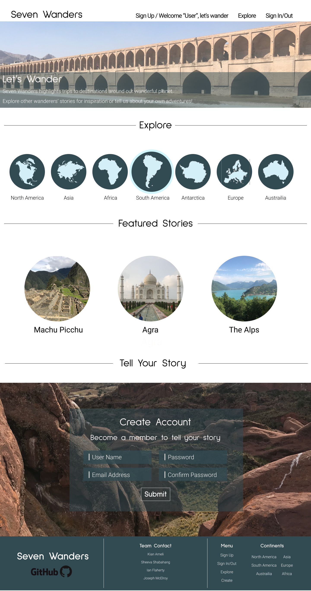
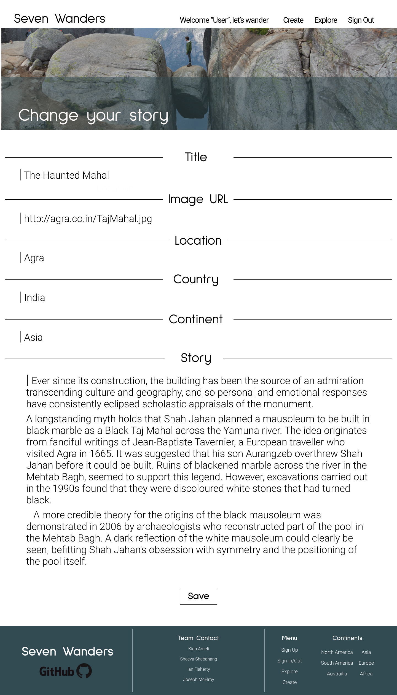

# Seven Wanders

## Overview

Seven Wanders is a travel blog where users can find and read user-submitted travel stories. The landing page invites visitors to explore stories by continent or read one of a few "Featured Stories". Registered users can submit their own stories with a photo and edit their previous posts. The site is aimed at inspiring users to decide their next destination and (hopefully) to offer a recommendation based on their own travels.

## Wireframes

Home

Explore

Detail

Create

Edit

Sign Up

Sign In

## Component Hierarchy

## Schemas

## API Endpoints

## Team Expectations

> [Read our team expectations manifesto here.](https://docs.google.com/document/d/1l8nFBRjAJudqV3y2pBvPw7_S7gMINpztjF4ZgiL9RvQ/edit?usp=sharing)

## MVP

## Post-MVP

## SWOT
